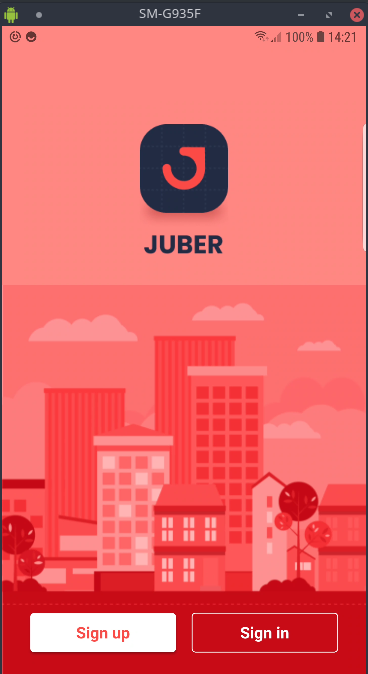
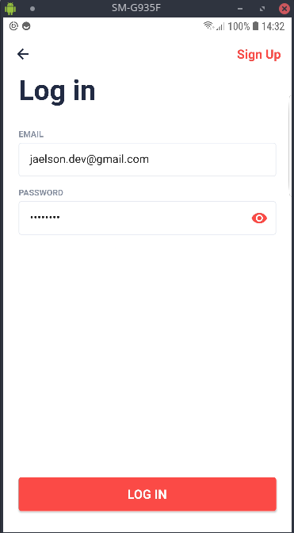
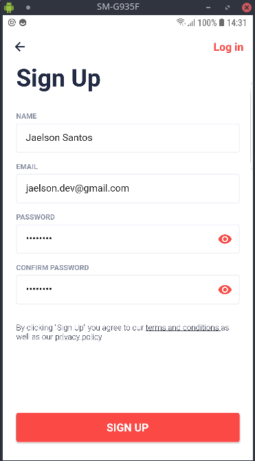
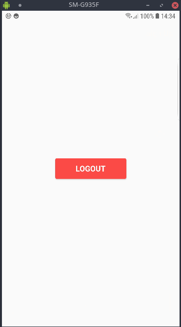

  

# JUBER - APP

Projeto voltado diretamente para estudos, assim tirando algumas dúvidas sobre flutter.

# SCREENSHOTS

 
  
  

 
  
  

## ESTRUTURA USADA

O que foi utilizado neste projeto?

- [Flutter Modular](https://github.com/Flutterando/modular)
- [MOBX](https://github.com/mobxjs/mobx.dart)
- [Slidy](https://github.com/Flutterando/slidy)

Qual api você consumiu neste projeto?

Neste projeto eu construí uma api usando o Lumen, o Lumen é um Micro-Framework PHP baseado no Laravel, ele possuí uma quantidade limitada de recursos nativos, diferente do Laravel, porém, como atendia muito bem a necessidade do projeto, então resolvi usá-lo.

Segue o repositório da api:

- [JUBER - API](https://github.com/jaelsondev/juber-api)

## OBSERVAÇÃO

Surgiro que crie uma conta no heroku e hospede a api, é suber fácil, deixarei abaixo um vídeo onde é explicado como subir:

- [Como subir a api no heroku](https://www.youtube.com/watch?v=639Pe0PpVLQ)

## É ISSO AÍ!!!

Espero que este mini-projeto contribua para sua evolução no flutter, caso tenha alguma dúvida pode me enviar um direct que responderei o mais rápido possível.

- [Git](https://github.com/jaelsondev)
- [Linkedin](https://www.linkedin.com/in/jaelsonsantos/)
